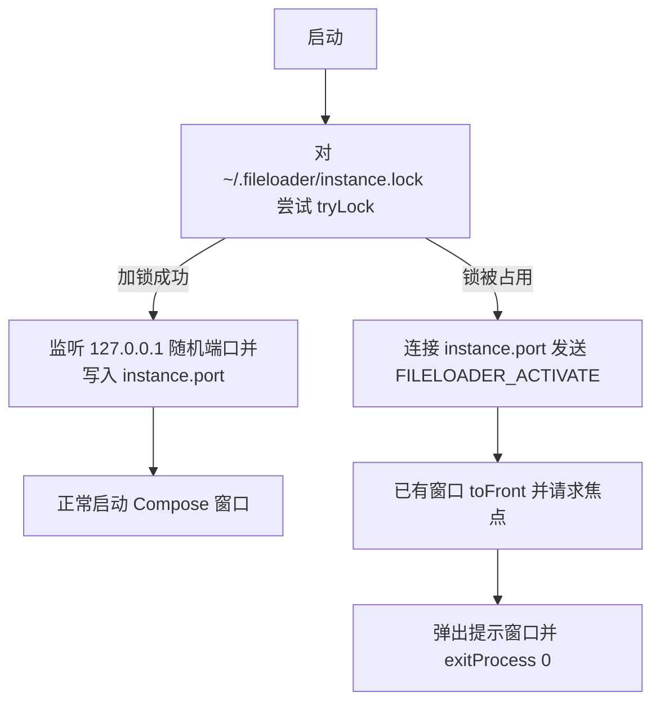

# FileLoader 项目开发维护文档

## 1. 项目概述
本项目是一个基于 Compose Desktop 的桌面端文件自动上传工具。

核心能力：
- 监听多个文件夹
- 检测文件写入稳定后自动入队上传
- 批次状态查询与下载（汇总报告 / 异常文件）
- 本地批次状态持久化（SQLite）

运行时数据目录：
- `~/.fileloader/fileLoader.properties`
- `~/.fileloader/batches.db`
- `~/.fileloader/logs/`（程序日志，可在“系统日志”弹窗查看）
- `~/.fileloader/instance.lock`（单实例锁）
- `~/.fileloader/instance.port`（主实例监听端口）

> 兼容迁移：若项目根目录存在历史配置或数据库，应用启动时会尝试迁移到上述用户目录。

---

## 2. 模块结构

### 2.1 `core` 模块
路径：`core/src/main/java/topview/fileloader`

职责分层：
- `config`：配置读取与保存（`AppConfig`）、数据目录（`AppPaths`）、日志落盘（`LoggingConfig`）
- `monitor`：多来源文件监控（`SourceMonitor`）
- `service`：上传、下载、批次状态、认证与自检服务，HTTP 客户端统一走 `DesktopApiClient`
- `persistence`：本地数据库（`BatchDatabase`）
- `model`：响应模型（`UploadResponse`、`DownloadResponse`）
- `util`：工具类（`ArchiveExtractor`）

### 2.2 `app-compose` 模块
路径：`app-compose/src/main/kotlin/topview/fileloader/app`

职责：
- Compose UI
- 应用启动入口（`ExeMainKt`）
- 单实例保护（`SingleInstanceGuard`）
- 单向状态管理（`AppViewModel`、`AppUiState`、`AppAction`）
- 上传协调与批次跟踪（`UploadCoordinator`、`BatchTracker`）
- 可注入的认证、批次、上传、任务和自检网关（`Gateways.kt`）

---

## 3. 构建与运行

在项目根目录执行：

- 启动应用：`./gradlew :app-compose:run`
- 运行全部测试：`./gradlew test`
- 只跑 Compose 模块测试：`./gradlew :app-compose:test`
- 运行真实文件夹全链路测试（本地 Mock）：`python3 scripts/test_upload_pipeline.py`
- 运行真实服务器全链路测试：`python3 scripts/test_upload_pipeline.py --live --user 00005625 --password <密码>`
- 构建所有模块：`./gradlew build`
- 生成 Compose JAR 到 `dist`：`./gradlew buildComposeJarToDist`
- 生成跨平台 uber JAR 到 `dist`：`./gradlew buildComposeUniversalJarToDist`

Windows EXE（仅 Windows 环境）：
- `gradlew.bat :app-compose:packageReleaseExe`

---

## 4. 核心流程

1. `startComposeApp()` 先获取单实例所有权；已有实例在运行时提示用户并直接退出（详见第 5 节）。
2. UI 将“添加上传来源”转换为 `AppAction`。
3. `SourceMonitor` 使用一个 `WatchService` 管理所有顶层文件夹，并在独立线程池检查文件稳定性。
4. `UploadCoordinator` 按来源创建批次、管理上传队列与失败重试。
5. `BatchTracker` 在上传完成后立即查询，并每 3 秒（`POLL_INTERVAL_SECONDS`）刷新尚未完成的批次，直到可下载或登录失效。
6. `AppViewModel` 将任务状态投影为单页 `AppUiState`，Compose 只负责渲染和发送动作。

---

## 5. 单实例保护

实现：`app-compose/src/main/kotlin/topview/fileloader/app/SingleInstanceGuard.kt`

启动流程：

要点：
- 用 `FileChannel.tryLock()` 而非 PID 文件：进程崩溃或被强杀时操作系统会自动释放锁，不会残留“假死”状态。
- `OverlappingFileLockException`（同一 JVM 内重复加锁）同样按“已被占用”处理。
- 锁文件不可创建/不可锁时**降级放行**（不阻止启动），仅记录 WARNING，避免因磁盘权限问题导致程序完全无法使用。
- 主实例通过 `SingleInstanceGuard.activationRequests`（`SharedFlow`）通知窗口前置；Compose 侧用 `LaunchedEffect` 收集。
- 第二个实例的提示文案写入标准输出，同时用 `JOptionPane` 弹窗；无图形环境时只保留控制台输出。

---

## 6. 登录态与上传暂停

- 未登录、登录过期、退出登录时，`UploadCoordinator` 通过 `pausedForAuth` 暂停上传：
  - 排队中的上传会在 `waitForAuthentication()` 里等待，重新登录后自动继续，无需重新添加来源。
  - `pauseForAuth()` 使用 `compareAndSet` 保证**幂等**，多个等待线程只会通知 UI 一次。
- `AppUiState.isUploadPaused` 驱动 UI 反馈：任务区显示“已暂停”，任务卡改用静态进度条并提示“已暂停，登录后自动继续”。
- 退出登录时 `AppViewModel.logout()` 立即调用 `suspendUploads()`，停止上传并清空待发送的轮询。
- `BatchTracker` 收到 401 时会自行置为未认证并停止轮询，只回调一次 `onAuthExpired`。
- `markLoggedIn()` 是唯一的“登录成功”入口：重置认证标记、恢复上传，并重新跟踪服务器处理中的任务，保证重新登录后进度能继续刷新。

> 历史问题（已修复）：退出登录后 `waitForAuthentication()` 的忙循环会反复触发登录弹窗并清空密码，表现为“登录框闪烁且关不掉”；重新登录后因未重新跟踪任务，进度条会一直停留在“服务器处理中”。

---

## 7. 维护说明

### 7.1 增加配置项
1. 在 `core/config/AppConfig` 中增加默认值与 getter/setter。
2. 在 `app-compose` 设置弹窗中增加对应输入项。
3. 验证配置落盘到 `~/.fileloader/fileLoader.properties`。

### 7.2 修改上传协议
在 `core/service/ProgressUploadService` 中修改 query 参数或 multipart 字段拼接。

### 7.3 调整 UI
在 `AppUiState` / `AppAction` 中先定义状态和动作，再修改无状态 Compose 页面；不要在 Composable 中直接调用网络或数据库。

### 7.4 桌面 API 契约

- 登录：`POST /api/desktop/auth/login?userId=...&password=...`
- 退出登录：`POST /api/desktop/auth/logout`
- 批次上传：`POST /api/desktop/batch/upload?batchId=...`，multipart 只包含 `file` 和 `fileName`
- 会话与连接检查：`GET /api/desktop/batch/batchRecords`
- 所有受保护接口使用 `Authorization: Bearer <token>`

### 7.5 服务器地址规范化规则

`AppConfig.normalizeServerUrl()` 是唯一入口，`loadConfig()` 与 `setServerUrl()` 都会调用：

| 输入 | 结果 |
| --- | --- |
| 空值 | `https://xssc.gdut.edu.cn` |
| 学校域名但非 `https` | `https://xssc.gdut.edu.cn` |
| 其他自定义地址（含测试环境 IP） | 原样保留 |
| 无法解析的字符串 | 原样保留，交由设置校验/自检提示 |

注意：地址发生实际变化时会调用 `clearAuthFields()` 清空 token，避免把旧环境的凭证带到新服务器。

> 历史行为变更：早期版本会把旧工作室主机 `10.21.76.73` 强制迁移到学校正式地址，现已移除，以便直接连接测试环境（见提交“移除旧版工作室主机强制迁移”；死常量已清理，测试同步验证工作室 IP 原样保留）。

### 7.6 修改单实例逻辑

- 修改行为后请同步更新 `SingleInstanceGuardTest`（覆盖“第二个实例被拒绝并触发激活”与“上个实例退出后可重新获取锁”）。
- 测试通过 `-Dfileloader.home=<临时目录>` 重定向数据目录（见 `AppPaths.HOME_OVERRIDE_PROPERTY`），避免污染真实用户配置。

---

## 8. 常见问题排查

- 启动后看不到历史批次：
  - 检查 `~/.fileloader/batches.db` 是否存在和可写。
- 需要清空全部本地历史批次记录：
  - **界面操作（推荐）**：点击右上角“设置” -> “本地历史数据” -> 点击“清空记录”，即可一键清空本地 SQLite 数据库。
  - **手动删除文件**：
    - Windows：文件资源管理器地址栏输入 `%USERPROFILE%\.fileloader`，删除 `batches.db`。
    - macOS / Linux：删除 `~/.fileloader/batches.db`。
  - 注意：若对方历史上曾使用过旧版本并曾在桌面生成过 `batches.db`，请一并删除桌面残留的旧文件，避免首次启动时被自动迁移。
- 上传失败：
  - 检查 `~/.fileloader/fileLoader.properties` 的 `server.url`。
  - 检查网络与服务端接口可达性。
- 启动时提示“文件上传助手已经在运行”：
  - 属于单实例保护的正常提示，程序会尝试把已有窗口前置。
  - 被拦截说明确实还有进程在运行（进程退出时锁会自动释放，不会误拦），可通过主类名确认：
    - macOS/Linux：`jps -l | grep -i fileloader`
    - Windows：`jps -l | findstr /i fileloader`
    - 仅 JAR 启动时也可用：`pgrep -fl 'FileLoader-compose.jar'`（注意直接用 `pgrep -fl FileLoader` 会误匹配路径中含该词的其他进程）
  - 若进程存在但窗口找不到，先结束该进程再重新启动；不要直接删除 `instance.lock`，否则会同时跑起两个实例。
  - 日志中出现“本次启动不启用单实例保护”的 WARNING 时，是数据目录不可写导致的降级行为，不会阻止启动。
- 退出登录后上传任务停在“已暂停，登录后自动继续”：
  - 属于预期行为，重新登录后会自动继续，无需重新添加来源。
- 构建失败：
  - 确认 JDK 17+
  - 执行 `./gradlew --stop && ./gradlew clean build` 重新验证。
